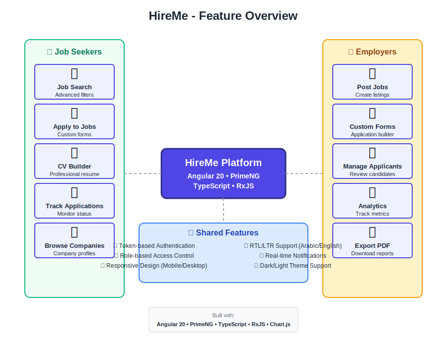

<div align="center">
  
  
  
  <br/>
  
  [](https://alyaarihazem.github.io/Hire-Me/)
  [](LICENSE)
  [](https://angular.io/)
  [](https://primeng.org/)
  [](https://www.typescriptlang.org/)
  
  **[Live Demo](https://alyaarihazem.github.io/Hire-Me/)** | **[Quick Start](QUICKSTART.md)** | **[Documentation](INTEGRATION_GUIDE.md)** | **[Report Bug](https://github.com/AlyaariHazem/Hire-Me/issues)**
  
</div>

---

## 📌 Overview

**HireMe** is a modern, full-featured recruitment platform that connects job seekers with employers. Built with cutting-edge technologies, it provides a seamless experience for both candidates searching for opportunities and companies looking to hire top talent.

### Key Capabilities

- 🎯 **For Job Seekers**: Browse jobs, view company profiles, apply with custom forms, build CV
- 🏢 **For Employers**: Post jobs, manage applicants, create custom application forms, review candidates
- 📊 **Interactive Dashboards**: Real-time updates and analytics for both user types
- 📱 **Responsive Design**: Fully optimized for desktop, tablet, and mobile devices
- 🌐 **RTL Support**: Native Arabic (RTL) and English support
- 🔒 **Secure Authentication**: Token-based auth with role-based access control

---

## ✨ Features

### For Job Seekers
- ✅ Advanced job search with filters (location, category, experience level, job type)
- ✅ Detailed job listings with company information
- ✅ Custom application forms per job
- ✅ CV builder and profile management
- ✅ Application tracking
- ✅ Browse companies directory

### For Employers
- ✅ Post and manage job listings
- ✅ Create custom job application forms
- ✅ Review and manage applicants
- ✅ Company profile management
- ✅ Applicant analytics and filtering
- ✅ PDF export functionality

### Technical Features
- ✅ **Angular 20** with standalone components and zoneless change detection
- ✅ **PrimeNG (Aura Theme)** for beautiful, accessible UI components
- ✅ **Lazy Loading** for optimized performance
- ✅ **HTTP Interceptors** for authentication and error handling
- ✅ **Chart.js** integration for data visualization
- ✅ **ngx-toastr** for user notifications
- ✅ **Docker** support for containerized deployment

---

## 🖼️ Screenshots

<div align="center">

### Job Listings Page


### Login Page


### Registration Page


</div>

---

## 🏗️ Architecture

<div align="center">

### System Architecture


### Feature Overview


</div>

---

## 🛠 Tech Stack

| Category           | Technology                                    |
|--------------------|-----------------------------------------------|
| **Framework**      | Angular 20                                    |
| **Language**       | TypeScript 5.8                                |
| **UI Components**  | PrimeNG 20 + PrimeUIX Aura Theme             |
| **Styling**        | SCSS, PrimeFlex                               |
| **State Management**| RxJS 7.8                                     |
| **Charts**         | Chart.js 4.5                                  |
| **Notifications**  | ngx-toastr 19                                 |
| **PDF Export**     | html2pdf.js 0.12                              |
| **Build Tools**    | Angular CLI, Vite                             |
| **Testing**        | Jasmine, Karma                                |
| **Deployment**     | GitHub Pages, Docker                          |

---

## 📂 Project Structure

```
Hire-Me/
├── src/
│   ├── app/
│   │   ├── auth/              # Authentication components
│   │   │   ├── login/
│   │   │   ├── register/
│   │   │   └── logout/
│   │   ├── pages/             # Feature modules
│   │   │   ├── jobs/          # Job listing and details
│   │   │   ├── companies/     # Company dashboard (lazy loaded)
│   │   │   ├── jobseeker/     # Job seeker dashboard (lazy loaded)
│   │   │   └── about-us/      # About and privacy pages
│   │   ├── core/              # Core services and interceptors
│   │   │   ├── services/
│   │   │   └── interceptors/
│   │   └── shared/            # Shared components and utilities
│   │       ├── components/    # Reusable UI components
│   │       └── models/        # TypeScript interfaces
│   ├── environments/          # Environment configurations
│   └── styles.scss            # Global styles
├── public/
│   ├── images/               # Static images and logos
│   ├── css/                  # Additional stylesheets
│   └── js/                   # External scripts
├── docs/
│   └── screenshots/          # Application screenshots
├── angular.json              # Angular workspace config
├── package.json              # Dependencies
├── tsconfig.json             # TypeScript config
├── Dockerfile                # Docker configuration
└── INTEGRATION_GUIDE.md      # Integration documentation


---

## 🚀 Getting Started

### Prerequisites

Before you begin, ensure you have the following installed:
- **Node.js** (v18 or higher)
- **npm** (v9 or higher)
- **Angular CLI** (v20 or higher): `npm install -g @angular/cli`

### Installation

1. **Clone the repository**
   ```bash
   git clone https://github.com/AlyaariHazem/Hire-Me.git
   cd Hire-Me
   ```

2. **Install dependencies**
   ```bash
   npm install
   ```

3. **Run the development server**
   ```bash
   npm start
   # or
   ng serve
   ```

4. **Open your browser**
   ```
   Navigate to: http://localhost:4200/Hire-Me
   ```

The application will automatically reload when you make changes to the source files.

### Build for Production

```bash
npm run build
```

The build artifacts will be stored in the `dist/` directory, optimized for production deployment.

---

## 🐳 Docker Deployment

### Build Docker Image

```bash
docker build -t hire-me-app .
```

### Run Docker Container

```bash
docker run -p 8080:80 hire-me-app
```

The application will be available at `http://localhost:8080`

---

## 🧪 Running Tests

### Unit Tests

```bash
npm test
# or
ng test
```

Tests are executed via [Karma](https://karma-runner.github.io) and written with [Jasmine](https://jasmine.github.io/).

### Code Coverage

```bash
ng test --code-coverage
```

Coverage reports will be generated in the `coverage/` directory.

---

## 📖 Usage Guide

### For Job Seekers

1. **Register/Login**: Create an account as a job seeker
2. **Browse Jobs**: Search and filter jobs by category, location, and experience
3. **View Details**: Click on any job to see full description and requirements
4. **Apply**: Fill out the application form (may include custom questions)
5. **Track Applications**: Monitor your applications in the job seeker dashboard
6. **Build CV**: Use the CV builder to create your professional resume

### For Employers

1. **Register/Login**: Create an account as an employer
2. **Post Jobs**: Create new job listings with detailed descriptions
3. **Create Application Forms**: Design custom application forms with various question types
4. **Review Applicants**: View and manage applications for your job postings
5. **Export Data**: Download applicant data as PDF for offline review
6. **Manage Profile**: Update company information and branding

---

## 🎨 Customization

### Theming

The application uses PrimeNG's Aura theme. You can customize colors and styles in:
- `src/app/prime-ng-theme.ts` - PrimeNG theme configuration
- `src/styles.scss` - Global styles and CSS variables

### Environment Configuration

Configure API endpoints and settings in:
- `src/environments/environment.ts` - Development environment
- `src/environments/environment.prod.ts` - Production environment

---

## 📚 API Integration

This application connects to a backend API. The API endpoints are configured in the environment files. Key services include:

- **Authentication**: Login, register, logout
- **Jobs**: List, search, create, update, delete jobs
- **Applications**: Submit applications, view applicant data
- **Companies**: Company profiles and management
- **Job Forms**: Custom application form builder

For detailed API integration examples, see [INTEGRATION_GUIDE.md](INTEGRATION_GUIDE.md).

---

## 🤝 Contributing

Contributions are welcome! Please follow these steps:

1. Fork the repository
2. Create a feature branch (`git checkout -b feature/AmazingFeature`)
3. Commit your changes (`git commit -m 'Add some AmazingFeature'`)
4. Push to the branch (`git push origin feature/AmazingFeature`)
5. Open a Pull Request

### Code Style

- Follow Angular style guide
- Use TypeScript strict mode
- Write meaningful commit messages
- Add comments for complex logic
- Update documentation for new features

---

## 📝 License

This project is licensed under the MIT License - see the [LICENSE](LICENSE) file for details.

---

## 👥 Authors

- **Hazem Alyaari** - [GitHub](https://github.com/AlyaariHazem)

---

## 🙏 Acknowledgments

- [Angular](https://angular.io/) - The web framework used
- [PrimeNG](https://primeng.org/) - UI component library
- [Chart.js](https://www.chartjs.org/) - Data visualization
- [GitHub Pages](https://pages.github.com/) - Hosting platform

---

## 📞 Support

If you have any questions or need help, please:
- Open an [issue](https://github.com/AlyaariHazem/Hire-Me/issues)
- Contact the maintainer
- Check the [documentation](INTEGRATION_GUIDE.md)

---

<div align="center">
  
  **Made with ❤️ using Angular 20**
  
  [⬆ Back to Top](#hire-me---منصة-التوظيف)
  
</div>
